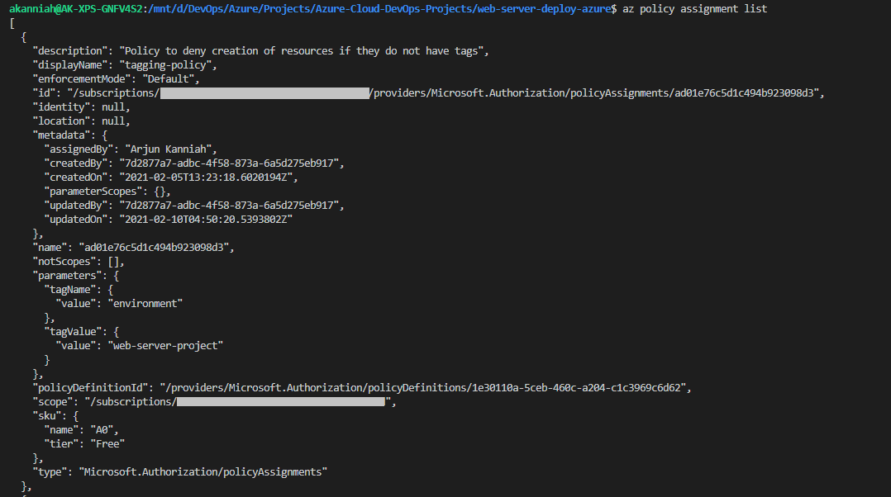
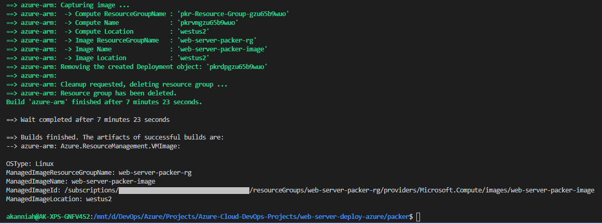
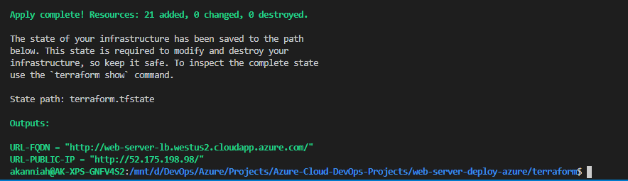

# Azure Infrastructure Operations Project: Deploying a scalable IaaS web server in Azure
Terraform powered IaaS to provision infrastructure in Azure and deploy a Packer built web server base image

## Introduction
This project will deploy a certain number of virtual machines through a Scale Set sitting behind an internet facing Load Balancer on Azure. All the necessary resources that are required viz., Resource Groups, Virtual Networks, Subnets, Network Interface Cards, Load Balancer and associated components are also deployed. Network security is also provided through Network Security Groups and attached to the Subnet.

## Dependencies
1. Create an [Azure Account](https://portal.azure.com) 
2. Install the [Azure CLI](https://docs.microsoft.com/en-us/cli/azure/install-azure-cli?view=azure-cli-latest)
3. Install [Packer](https://www.packer.io/downloads)
4. Install [Terraform](https://www.terraform.io/downloads.html)

### Getting Started
1. Clone this repository 
2. Build a Packer Image
3. Deploy the infrastructure through Terraform

## Instructions

### Packer
1. All Packer related files are within the `packer` folder. Make it your current working directory.
2. Create a resource group in Azure to hold your Packer image. This project uses the name `web-server-packer-rg`. Use the command - `az group create -n web-server-packer-rg -l westus2`
3. Create environment variables that will store your Azure tokens viz.,`appId`, `password` retreived from the output of `az ad sp create-for-rbac --role="Contributor" --name="web-server-sp"` and `subscription_id` retreived from the output of `az account show`. Store them as `ARM_CLIENT_ID`, `ARM_CLIENT_SECRET` and `ARM_SUBSCRIPTION_ID` in your path as environment variables respectively.
3. Review and edit `vars.json` to your custom values or leave them to the default values to run it as is. Use the default values as a reference and change them to your requirement. 
4. Build and deploy your Packer image using the command - `packer build -var-file=vars.json server.json`
5. Delete your Packer image AFTER you have successfully deleted all the Azure resources created by Terraform. Use the command - `az image delete -g web-server-packer-rg -n web-server-packer-image`

### Terraform
1. All Terraform related files are within the `terraform` folder. Make it your current working directory.
2. Execute `terraform init` to initialize Terraform properties and settings.
3. Review and edit `vars.tf` to your custom values or leave them to the default values to run it as is. Use the default values as a reference and change them to your requirement. If you want to provide the values at run-time, comment the default value lines for each variables.
4. Create a Terraform plan using the command - `terraform plan -out solution.plan`. This will review the default varaibles and create a plan that can be applied. The plan is a state definition that Terraform will work to achieve. Review the output to see what resources are going to be created.
5. Apply the Terraform plan using the command - `terraform apply "solution.plan"`. This will programatically deploy the required Azure infrastructure to host the Packer created web server image on a set of VMs behind a Load Balancer.

### Clean Up
1. Destroy ALL Azure resources created by Terraform using the command - `terraform destroy`
2. Delete your Packer image in Azure. Use the command - `az image delete -g web-server-packer-rg -n web-server-packer-image`

## Output
1. Azure tagging policy output:

2. Packer output:

3. Terraform output:

